# Largest Component Stats Report

Generated from `banc_stats.html`, `fafb_stats.html`, and `mcns_stats.html` in `outputs/high_degree_bfs_20K/`.

## Cross-Dataset Summary

| Dataset | Cells | Typed cells | Unique Primary Cell Types (1 per cell) | Unique Cell Types (all assigned types) | Combined length | Combined area | Combined volume |
| ------- | ----- | ----------- | -------------------------------------- | -------------------------------------- | --------------- | ------------- | --------------- |
| BANC    | 190   | 183         | 73                                     | 78                                     |                 |               |                 |
| FAFB    | 182   | 182         | 61                                     | 70                                     | 430,824 µm      | 878,366 µm 2  | 63,992 µm 3     |
| MCNS    | 605   | 604         | 115                                    | 115                                    |                 |               |                 |

### Comparison Cells

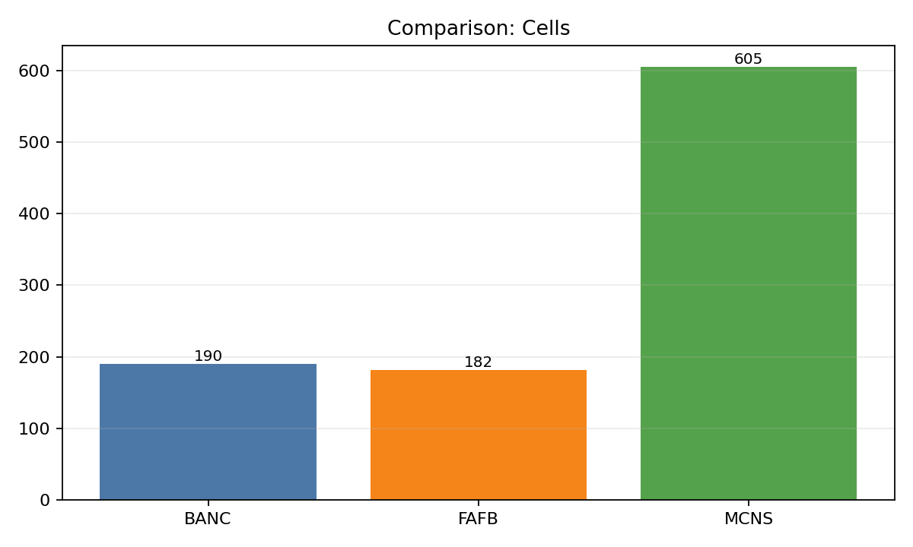

### Comparison Typed Cells

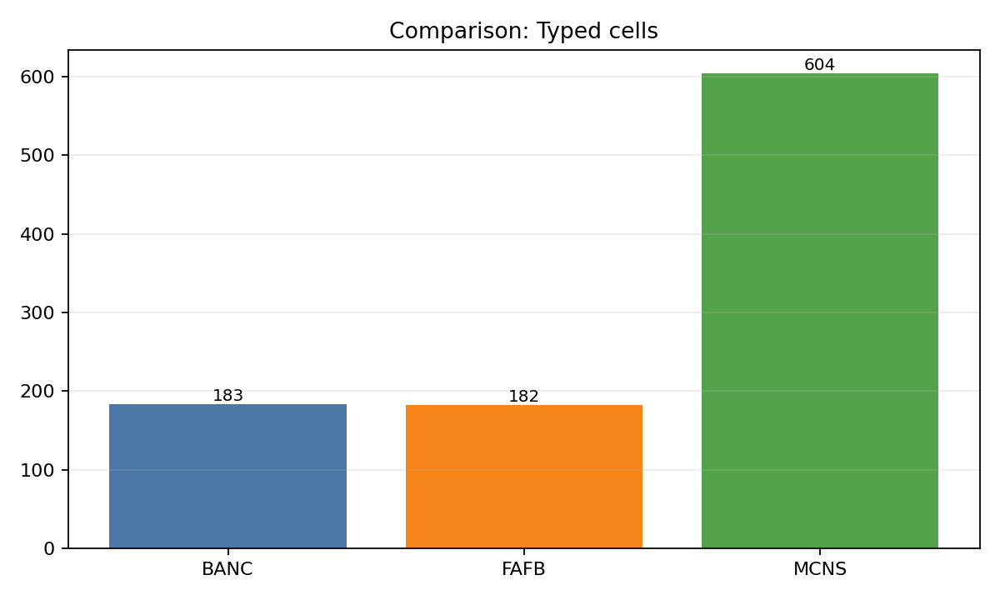

## BANC

Source: `high_degree_bfs_20K/banc_stats.html`

### Summary

| Metric                                   | Value          |
| ---------------------------------------- | -------------- |
| Cells                                    | 190            |
| - Typed cells                            | 183            |
| - Unique Primary Cell Types (1 per cell) | 73             |
| - Unique Cell Types (all assigned types) | 78             |
| - Internal connections / syns            | 276 / 2,023    |
| - Ext. upstream partners / syns          | 4,257 / 52,231 |
| - Ext. downstream partners / syns        | 4,802 / 55,657 |

### Top Primary Cell Types

| Metric     | Value |
| ---------- | ----- |
| KCg-m      | 52    |
| KCab       | 42    |
| KCg-d      | 7     |
| KCapbp-ap1 | 6     |
| KCapbp-ap2 | 3     |
| KCab-p     | 3     |
| lLN2P_c    | 2     |
| KCab-m     | 2     |
| ORN_V      | 2     |
| APL        | 1     |
| V_ilPN     | 1     |
| PS157      | 1     |
| ATL014     | 1     |
| AN05B050   | 1     |
| PLP143     | 1     |

_Showing first 15 rows out of 25._

### Top Input Types (Synapses / Partners)

| Metric   | Value                              |
| -------- | ---------------------------------- |
| KCab     | Syns 3,352 (6%) Partners 493 (11%) |
| KCg-m    | Syns 3,308 (6%) Partners 583 (13%) |
| ORN_V    | Syns 1,551 (3%) Partners 73 (2%)   |
| - na -   | Syns 1,240 (2%) Partners 202 (5%)  |
| lLN1_bc  | Syns 1,065 (2%) Partners 30 (1%)   |
| APL      | Syns 941 (2%) Partners 1 (0%)      |
| ORN_VL1  | Syns 744 (1%) Partners 86 (2%)     |
| lLN2F_b  | Syns 675 (1%) Partners 4 (0%)      |
| lLN2F_a  | Syns 556 (1%) Partners 4 (0%)      |
| VA2_adPN | Syns 542 (1%) Partners 2 (0%)      |

### Top Output Types (Synapses / Partners)

| Metric     | Value                               |
| ---------- | ----------------------------------- |
| KCg-m      | Syns 6,681 (12%) Partners 766 (16%) |
| KCab       | Syns 6,614 (11%) Partners 563 (11%) |
| lLN1_bc    | Syns 1,751 (3%) Partners 30 (1%)    |
| - na -     | Syns 1,406 (2%) Partners 182 (4%)   |
| KCapbp-ap1 | Syns 894 (2%) Partners 101 (2%)     |
| lLN2X03    | Syns 798 (1%) Partners 12 (0%)      |
| APL        | Syns 773 (1%) Partners 2 (0%)       |
| KCg-d      | Syns 692 (1%) Partners 74 (1%)      |
| KCapbp-m   | Syns 676 (1%) Partners 77 (2%)      |
| lLN2F_b    | Syns 672 (1%) Partners 4 (0%)       |

### Top Input Regions

| Metric            | Value    |
| ----------------- | -------- |
| Top Input Regions | Synapses |
| MB_CA_R           | 11,688   |
| AL_R              | 9,691    |
| AL_L              | 4,703    |
| MB_PED_R          | 2,470    |
| MB_ML_R           | 2,377    |
| LAL_R             | 1,966    |
| MB_VL_R           | 1,751    |
| LH_R              | 1,321    |
| IB_L              | 926      |
| VES_R             | 904      |

### Top Output Regions

| Metric             | Value    |
| ------------------ | -------- |
| Top Output Regions | Synapses |
| AL_R               | 10,270   |
| MB_CA_R            | 7,813    |
| MB_PED_R           | 4,447    |
| MB_ML_R            | 3,745    |
| AL_L               | 3,200    |
| MB_VL_R            | 2,920    |
| LH_R               | 2,348    |
| LH_L               | 2,050    |
| PLP_L              | 1,820    |
| SCL_L              | 1,445    |

### Neurotransmitter Types

| Metric                 | Value     |
| ---------------------- | --------- |
| Neurotransmitter Types | Num Cells |
| DA                     | 100       |
| ACH                    | 39        |
| GABA                   | 22        |
| GLUT                   | 11        |
| SER                    | 6         |
| unspecified            | 12        |

### Side

| Metric | Value     |
| ------ | --------- |
| Side   | Num Cells |
| left   | 32        |
| right  | 158       |

### Flow

| Metric      | Value     |
| ----------- | --------- |
| Flow        | Num Cells |
| afferent    | 7         |
| intrinsic   | 172       |
| unspecified | 11        |

### Super Class

| Metric                       | Value     |
| ---------------------------- | --------- |
| Super Class                  | Num Cells |
| central_brain_intrinsic      | 170       |
| sensory                      | 7         |
| ascending                    | 2         |
| visual_projection            | 2         |
| visual_centrifugal           | 1         |
| ventral_nerve_cord_intrinsic | 1         |
| unspecified                  | 7         |

### Class

| Metric                          | Value     |
| ------------------------------- | --------- |
| Class                           | Num Cells |
| kenyon_cell                     | 116       |
| antennal_lobe_projection_neuron | 10        |
| olfactory_receptor_neuron       | 7         |
| antennal_lobe_local_neuron      | 5         |
| lateral_horn_output_neuron      | 3         |
| ascending_neuron                | 2         |
| lateral_horn_local_neuron       | 2         |
| mushroom_body_extrinsic_neuron  | 1         |
| medulla_tangential              | 1         |
| lateral_horn_centrifugal_neuron | 1         |

### Sub Class

| Metric                                       | Value     |
| -------------------------------------------- | --------- |
| Sub Class                                    | Num Cells |
| KCg                                          | 57        |
| KCab                                         | 45        |
| KCapbp                                       | 9         |
| uniglomerular_projection_neuron              | 5         |
| multiglomerular_projection_neuron            | 5         |
| antenna_olfactory_receptor_neuron            | 4         |
| maxillary_palp_olfactory_receptor_neuron     | 3         |
| ventral_nerve_cord_bilateral_interconnecting | 1         |
| unspecified                                  | 61        |

### Nerve

| Metric               | Value     |
| -------------------- | --------- |
| Nerve                | Num Cells |
| left_antennal_nerve  | 5         |
| right_antennal_nerve | 2         |
| unspecified          | 183       |

### Hemilineage

| Metric           | Value     |
| ---------------- | --------- |
| Hemilineage      | Num Cells |
| MBp1             | 40        |
| MBp4             | 32        |
| MBp3             | 20        |
| MBp2             | 19        |
| putative_primary | 16        |
| ALv1             | 4         |
| ALl1_dorsal      | 3         |
| ALl1_ventral     | 3         |
| 05B              | 2         |
| ALv2             | 2         |

### Plots

#### Top Input Regions

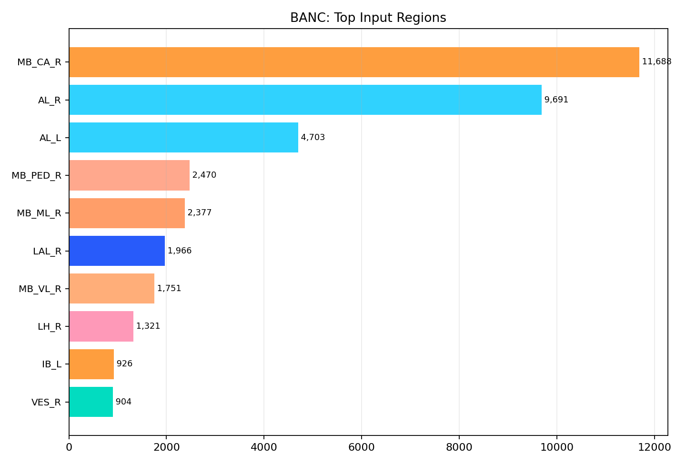

#### Top Output Regions

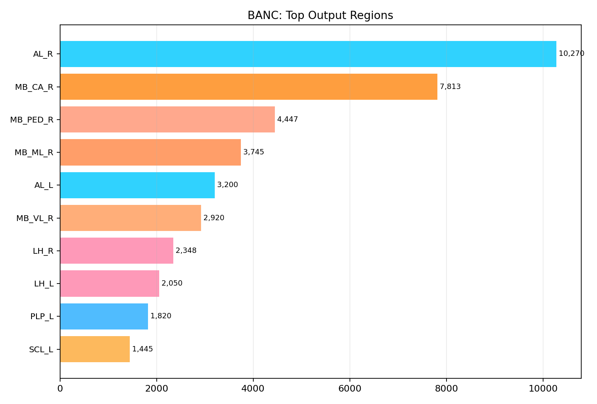

#### Neurotransmitter Types

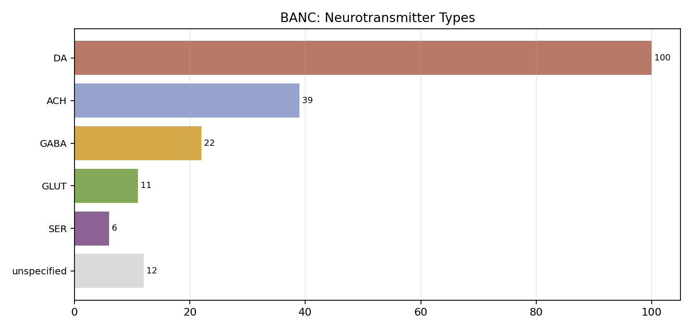

#### Side

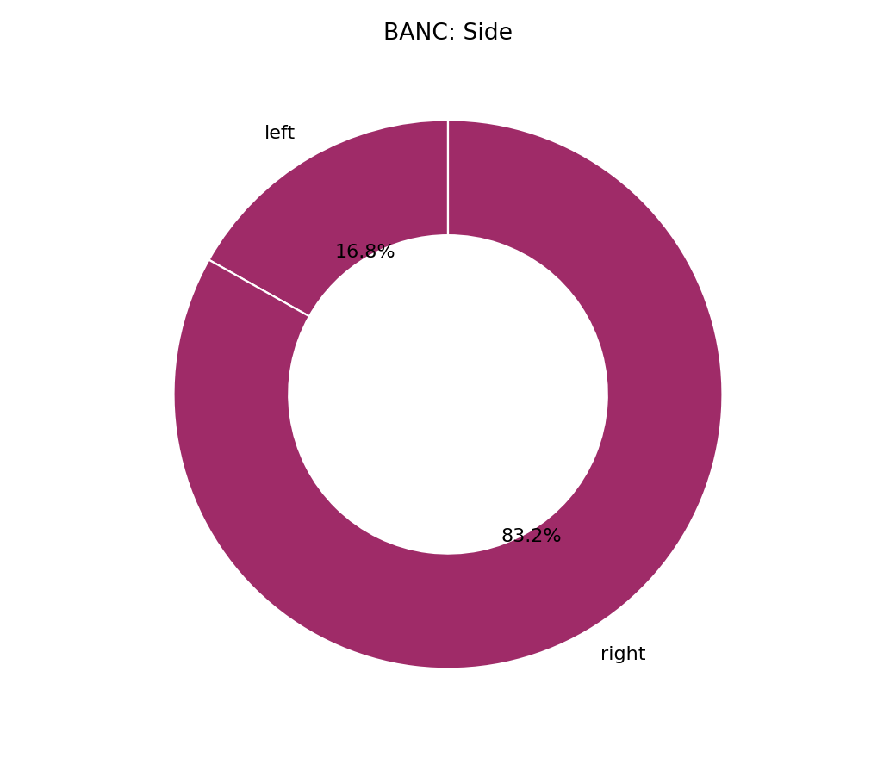

#### Flow

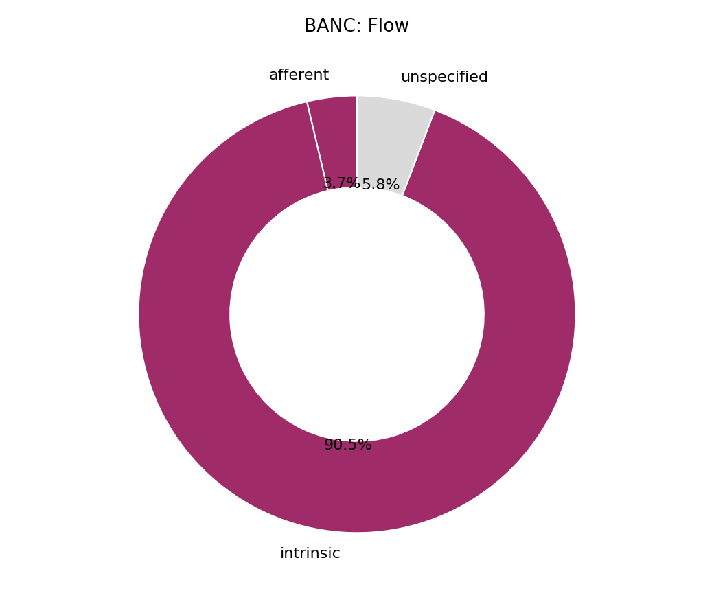

#### Super Class

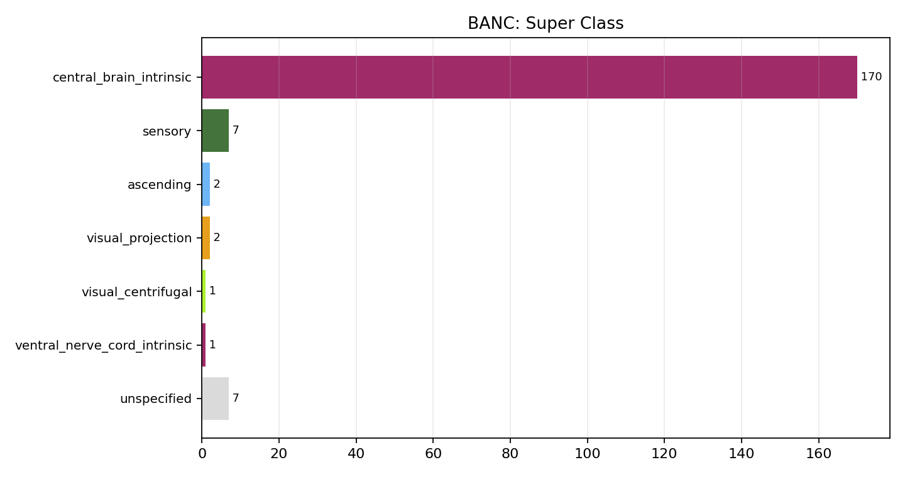

#### Class

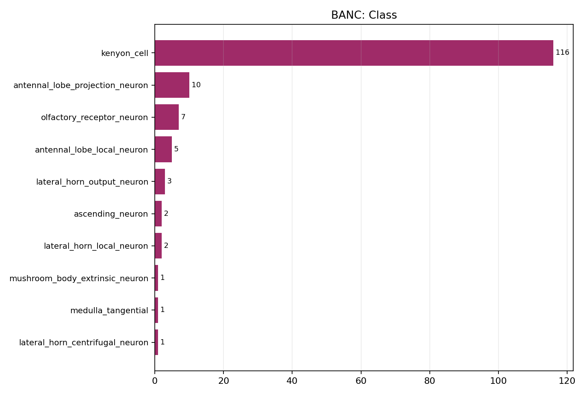

#### Sub Class

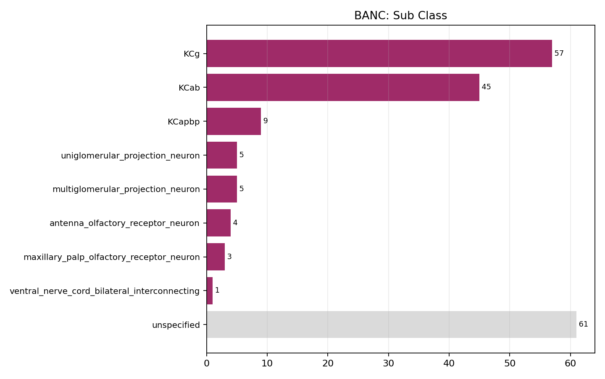

#### Nerve

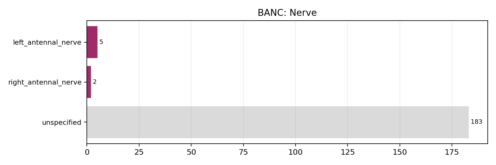

#### Hemilineage

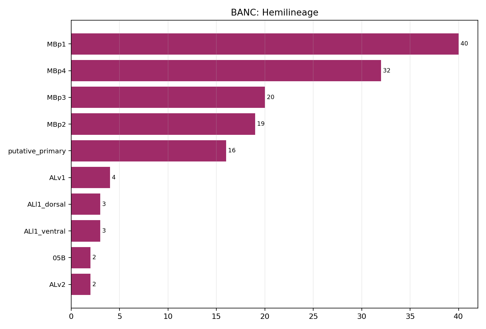

## FAFB

Source: `high_degree_bfs_20K/fafb_stats.html`

### Summary

| Metric                                   | Value            |
| ---------------------------------------- | ---------------- |
| Cells                                    | 182              |
| - Typed cells                            | 182              |
| - Unique Primary Cell Types (1 per cell) | 61               |
| - Unique Cell Types (all assigned types) | 70               |
| - Combined length                        | 430,824 µm       |
| - Combined area                          | 878,366 µm 2     |
| - Combined volume                        | 63,992 µm 3      |
| - Internal connections / syns            | 262 / 3,804      |
| - Ext. upstream partners / syns          | 14,003 / 208,683 |
| - Ext. downstream partners / syns        | 15,034 / 275,427 |

### Top Primary Cell Types

| Metric | Value |
| ------ | ----- |
| T5b    | 31    |
| T4b    | 23    |
| Mi1    | 13    |
| Tm9    | 12    |
| T5c    | 12    |
| T4d    | 11    |
| T4c    | 6     |
| Li14   | 3     |
| T2     | 3     |
| Tm3    | 3     |
| T5d    | 3     |
| LMa2   | 2     |
| Li16   | 2     |
| LPi05  | 2     |
| LC9    | 2     |

_Showing first 15 rows out of 25._

### Top Input Types (Synapses / Partners)

| Metric | Value                               |
| ------ | ----------------------------------- |
| Tm9    | Syns 30,153 (14%) Partners 751 (5%) |
| Tm1    | Syns 10,221 (5%) Partners 727 (5%)  |
| T4c    | Syns 7,782 (4%) Partners 889 (6%)   |
| T4b    | Syns 7,126 (3%) Partners 711 (5%)   |
| Mi1    | Syns 6,873 (3%) Partners 506 (4%)   |
| T5c    | Syns 6,715 (3%) Partners 764 (5%)   |
| T5a    | Syns 6,051 (3%) Partners 589 (4%)   |
| LC17   | Syns 5,872 (3%) Partners 142 (1%)   |
| T4a    | Syns 5,700 (3%) Partners 617 (4%)   |
| T5b    | Syns 5,206 (2%) Partners 608 (4%)   |

### Top Output Types (Synapses / Partners)

| Metric | Value                              |
| ------ | ---------------------------------- |
| T5a    | Syns 19,095 (7%) Partners 736 (5%) |
| T5b    | Syns 18,319 (7%) Partners 756 (5%) |
| T5c    | Syns 16,145 (6%) Partners 758 (5%) |
| T5d    | Syns 14,685 (5%) Partners 719 (5%) |
| T4a    | Syns 11,348 (4%) Partners 698 (5%) |
| T4c    | Syns 9,640 (3%) Partners 732 (5%)  |
| T4b    | Syns 9,559 (3%) Partners 680 (4%)  |
| T4d    | Syns 9,413 (3%) Partners 692 (5%)  |
| Tm9    | Syns 7,632 (3%) Partners 711 (5%)  |
| T2     | Syns 5,135 (2%) Partners 560 (4%)  |

### Top Input Regions

| Metric            | Value    |
| ----------------- | -------- |
| Top Input Regions | Synapses |
| LO_R              | 83,067   |
| ME_R              | 46,625   |
| AVLP_R            | 21,187   |
| PVLP_R            | 18,804   |
| LOP_R             | 15,533   |
| ME_L              | 8,662    |
| LOP_L             | 7,209    |
| PLP_R             | 2,025    |
| LO_L              | 2,010    |
| ICL_R             | 1,481    |

### Top Output Regions

| Metric             | Value    |
| ------------------ | -------- |
| Top Output Regions | Synapses |
| LO_R               | 118,474  |
| ME_R               | 87,227   |
| LOP_R              | 23,815   |
| AVLP_R             | 19,541   |
| ME_L               | 6,885    |
| PVLP_R             | 5,241    |
| IPS_R              | 3,475    |
| LOP_L              | 3,367    |
| LO_L               | 1,911    |
| GNG                | 1,617    |

### Neurotransmitter Types

| Metric                 | Value     |
| ---------------------- | --------- |
| Neurotransmitter Types | Num Cells |
| ACH                    | 141       |
| GABA                   | 25        |
| GLUT                   | 11        |
| unspecified            | 5         |

### Side

| Metric | Value     |
| ------ | --------- |
| Side   | Num Cells |
| left   | 7         |
| right  | 175       |

### Flow

| Metric    | Value     |
| --------- | --------- |
| Flow      | Num Cells |
| afferent  | 1         |
| intrinsic | 181       |

### Super Class

| Metric             | Value     |
| ------------------ | --------- |
| Super Class        | Num Cells |
| optic              | 156       |
| visual_projection  | 11        |
| central            | 11        |
| visual_centrifugal | 3         |
| ascending          | 1         |

### Class

| Metric               | Value     |
| -------------------- | --------- |
| Class                | Num Cells |
| optic_lobe_intrinsic | 154       |
| bilateral            | 5         |
| AN                   | 1         |
| unspecified          | 22        |

### Sub Class

| Metric                  | Value     |
| ----------------------- | --------- |
| Sub Class               | Num Cells |
| t5_neuron               | 47        |
| t4_neuron               | 41        |
| transmedullary          | 18        |
| medulla_intrinsic       | 14        |
| lobula_intrinsic        | 10        |
| t2_neuron               | 4         |
| lobula_medulla_amacrine | 3         |
| lobula_plate_intrinsic  | 3         |
| proximal_medulla        | 2         |
| centrifugal             | 2         |

### Nerve

| Metric      | Value     |
| ----------- | --------- |
| Nerve       | Num Cells |
| CV          | 1         |
| unspecified | 181       |

### Hemilineage

| Metric           | Value     |
| ---------------- | --------- |
| Hemilineage      | Num Cells |
| putative_primary | 6         |
| VPNd3            | 2         |
| VLPa1_lateral    | 2         |
| ALl1_ventral     | 2         |
| VPNp3            | 1         |
| VPNl&d1_lateral  | 1         |
| VLPl1_or_VLPl5   | 1         |
| VLPl&p2_lateral  | 1         |
| VLPp&l1_anterior | 1         |
| VPNv1            | 1         |

### Plots

#### Top Input Regions

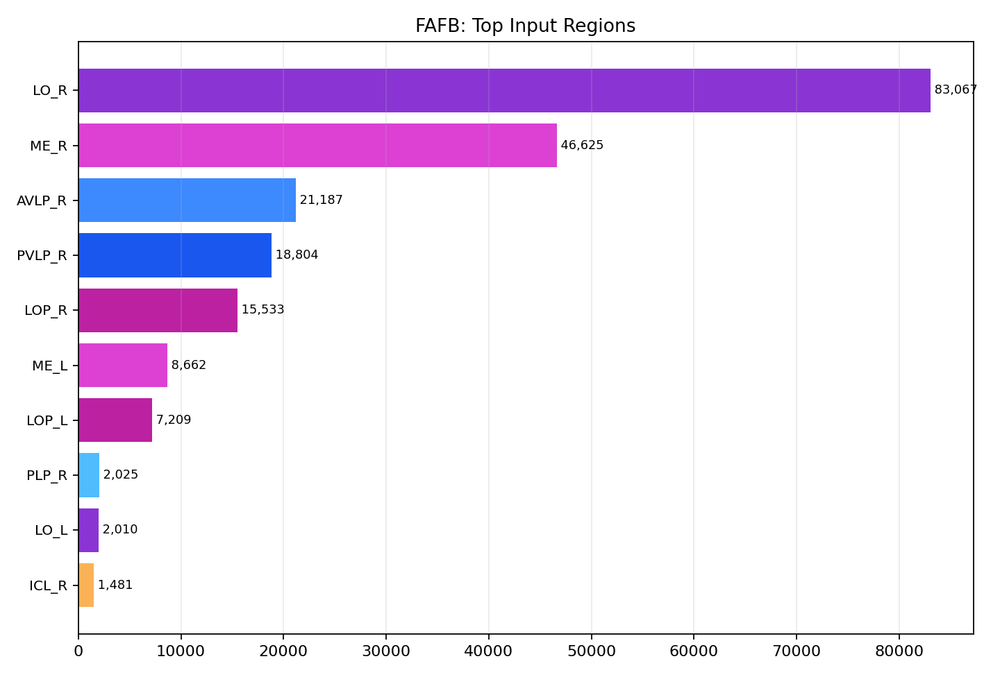

#### Top Output Regions

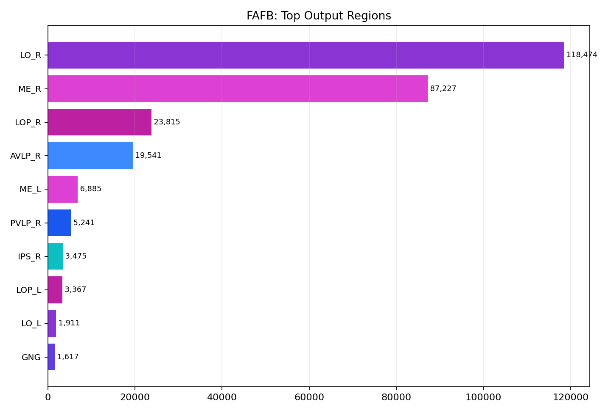

#### Neurotransmitter Types

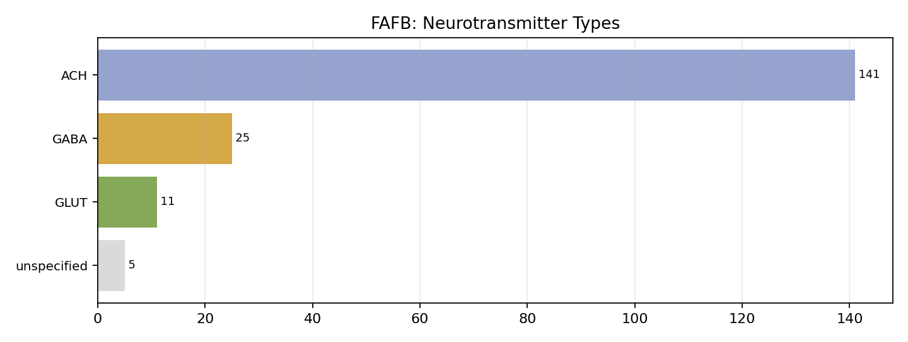

#### Side

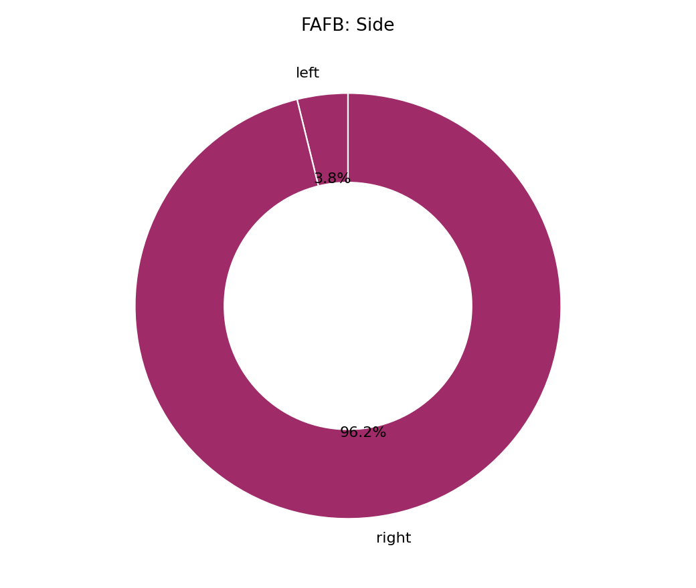

#### Flow

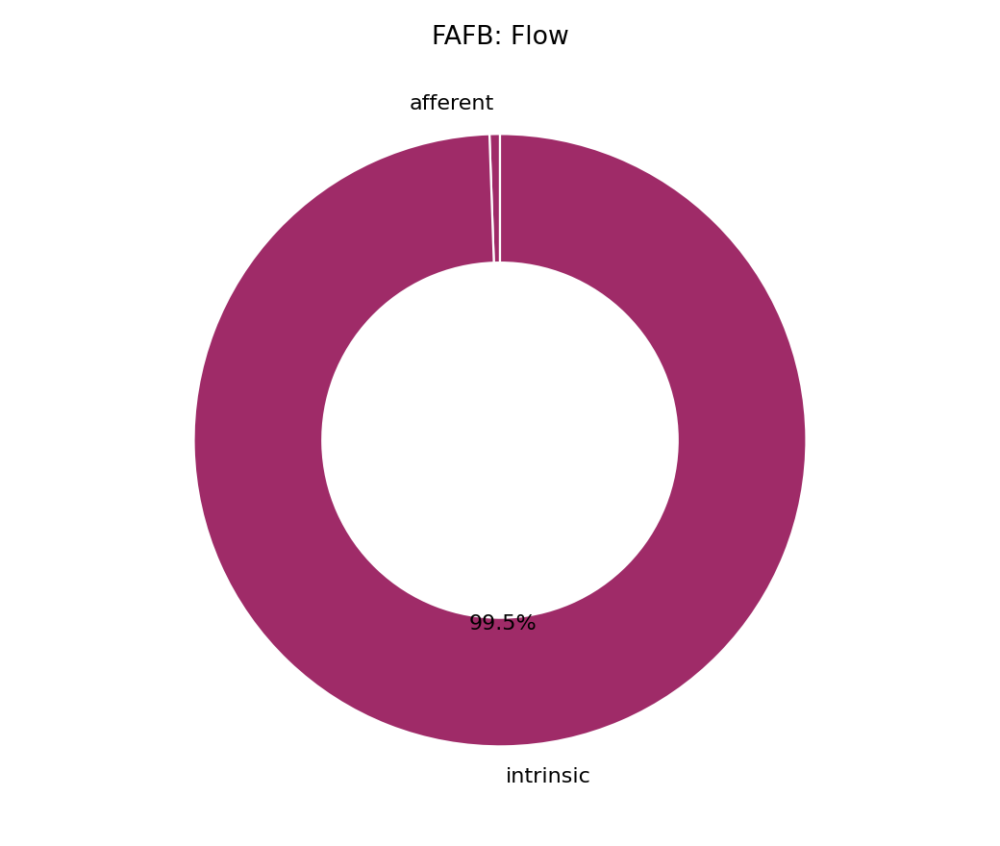

#### Super Class

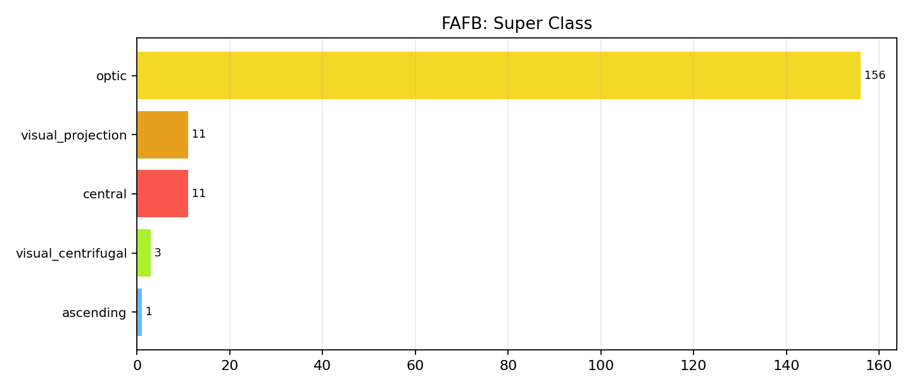

#### Class

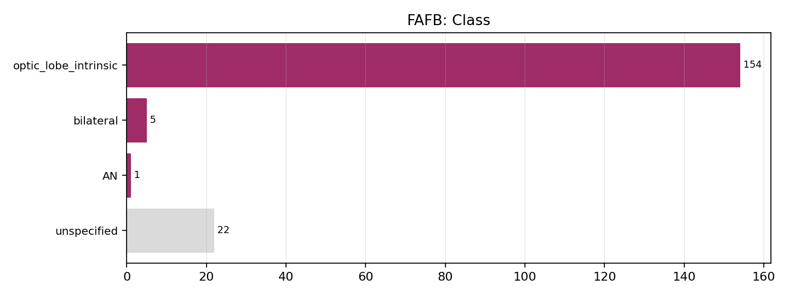

#### Sub Class

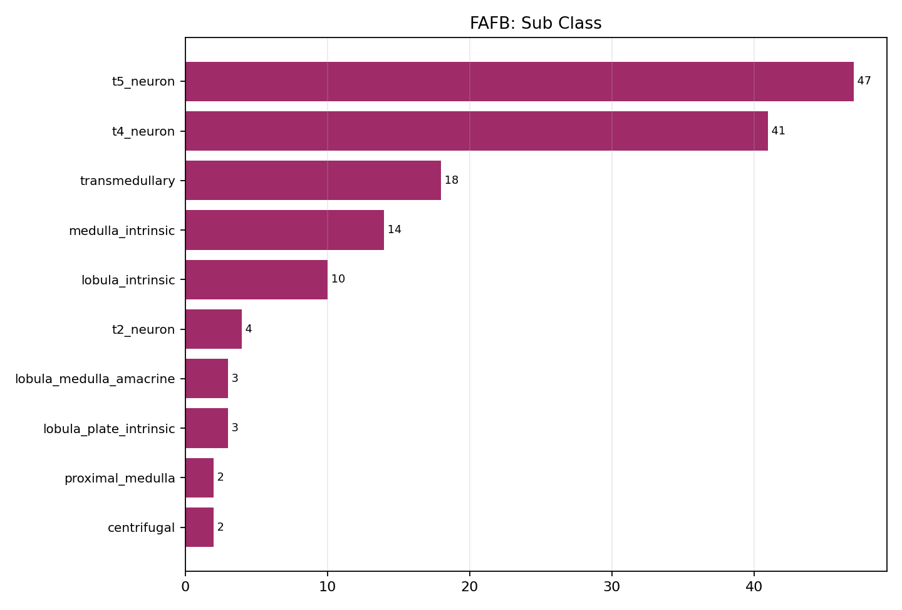

#### Nerve

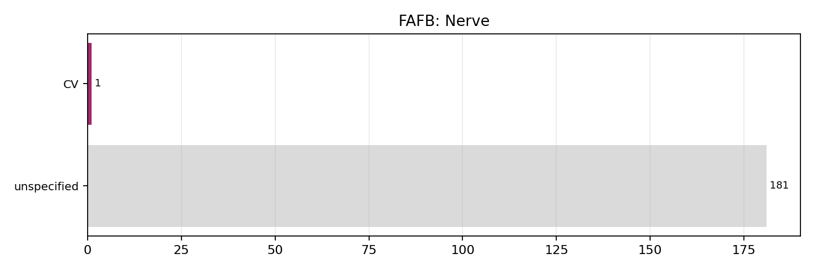

#### Hemilineage

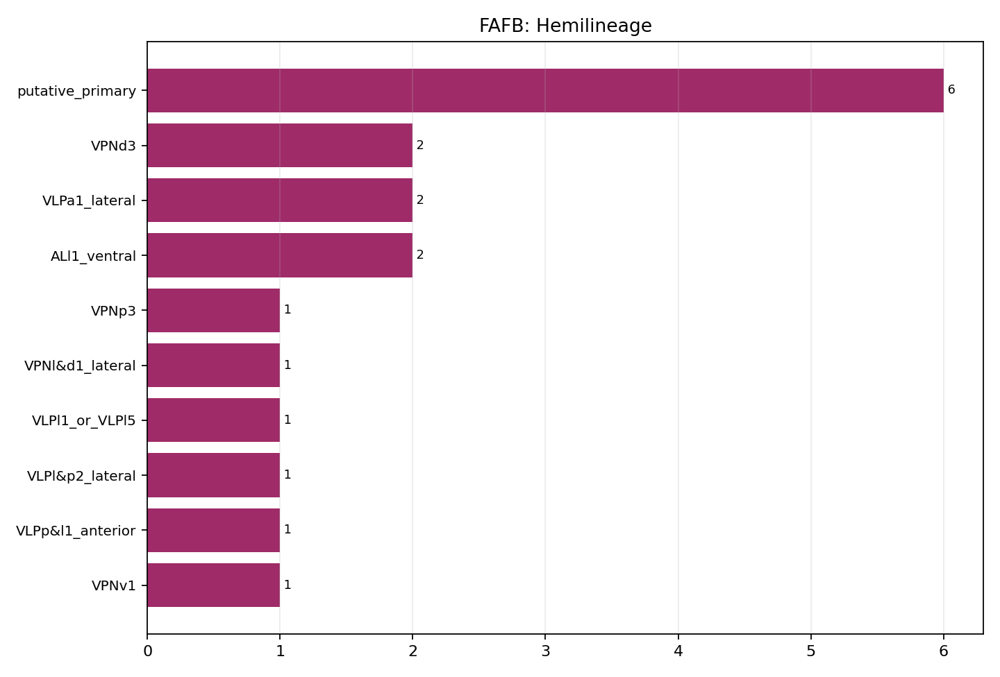

## MCNS

Source: `high_degree_bfs_20K/mcns_stats.html`

### Summary

| Metric                                   | Value            |
| ---------------------------------------- | ---------------- |
| Cells                                    | 605              |
| - Typed cells                            | 604              |
| - Unique Primary Cell Types (1 per cell) | 115              |
| - Unique Cell Types (all assigned types) | 115              |
| - Internal connections / syns            | 973 / 13,559     |
| - Ext. upstream partners / syns          | 18,700 / 323,043 |
| - Ext. downstream partners / syns        | 21,084 / 487,444 |

### Top Primary Cell Types

| Metric | Value |
| ------ | ----- |
| Tm9    | 85    |
| T4c    | 76    |
| T4d    | 74    |
| T4b    | 51    |
| Tm1    | 40    |
| T5c    | 23    |
| T5b    | 23    |
| T4a    | 22    |
| Mi9    | 17    |
| Mi1    | 13    |
| T5d    | 12    |
| Tm2    | 9     |
| LC12   | 8     |
| Tm4    | 7     |
| T5a    | 7     |

_Showing first 15 rows out of 25._

### Top Input Types (Synapses / Partners)

| Metric | Value                              |
| ------ | ---------------------------------- |
| Tm9    | Syns 30,230 (9%) Partners 878 (5%) |
| Mi1    | Syns 18,393 (5%) Partners 633 (3%) |
| T5a    | Syns 14,747 (4%) Partners 722 (4%) |
| T4a    | Syns 14,232 (4%) Partners 762 (4%) |
| Tm1    | Syns 9,869 (3%) Partners 736 (4%)  |
| Tm3    | Syns 8,975 (3%) Partners 636 (3%)  |
| Mi9    | Syns 8,931 (3%) Partners 575 (3%)  |
| L2     | Syns 7,486 (2%) Partners 90 (0%)   |
| T4b    | Syns 7,301 (2%) Partners 764 (4%)  |
| Mi4    | Syns 6,360 (2%) Partners 468 (2%)  |

### Top Output Types (Synapses / Partners)

| Metric | Value                              |
| ------ | ---------------------------------- |
| T5a    | Syns 28,240 (6%) Partners 837 (4%) |
| T5b    | Syns 26,815 (5%) Partners 851 (4%) |
| T5c    | Syns 25,055 (5%) Partners 857 (4%) |
| T5d    | Syns 22,706 (5%) Partners 807 (4%) |
| T4a    | Syns 17,551 (4%) Partners 840 (4%) |
| T4b    | Syns 14,359 (3%) Partners 836 (4%) |
| T4d    | Syns 14,225 (3%) Partners 845 (4%) |
| T4c    | Syns 14,061 (3%) Partners 856 (4%) |
| Tm9    | Syns 9,468 (2%) Partners 851 (4%)  |
| Pm2a   | Syns 9,113 (2%) Partners 91 (0%)   |

### Neurotransmitter Types

| Metric                 | Value     |
| ---------------------- | --------- |
| Neurotransmitter Types | Num Cells |
| ACH                    | 526       |
| GLUT                   | 43        |
| GABA                   | 27        |
| OCT                    | 1         |
| DA                     | 1         |
| unspecified            | 7         |

### Side

| Metric | Value     |
| ------ | --------- |
| Side   | Num Cells |
| left   | 27        |
| right  | 578       |

### Super Class

| Metric             | Value     |
| ------------------ | --------- |
| Super Class        | Num Cells |
| ol_intrinsic       | 533       |
| visual_projection  | 28        |
| cb_intrinsic       | 20        |
| visual_centrifugal | 8         |
| ascending_neuron   | 7         |
| descending_neuron  | 6         |
| sensory_ascending  | 3         |

### Class

| Metric                        | Value     |
| ----------------------------- | --------- |
| Class                         | Num Cells |
| mechanosensory_proprioceptive | 3         |
| ol_bilateral                  | 1         |
| unspecified                   | 601       |

### Sub Class

| Metric               | Value     |
| -------------------- | --------- |
| Sub Class            | Num Cells |
| BA                   | 6         |
| xn                   | 3         |
| campaniform_sensilla | 3         |
| it                   | 1         |
| ut                   | 1         |
| nt                   | 1         |
| IA                   | 1         |
| unspecified          | 589       |

### Plots

- `UNASGD`: `Synapses: 336,602`
- `UNASGD`: `Synapses: 501,003`
  
  #### Neurotransmitter Types

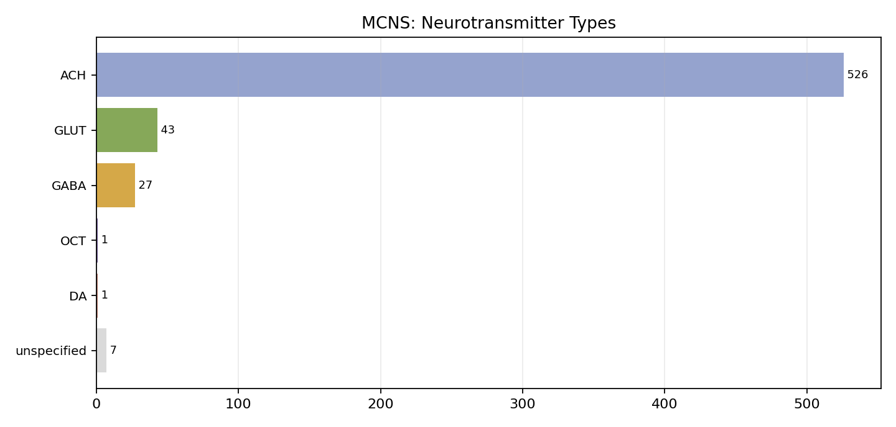

#### Side

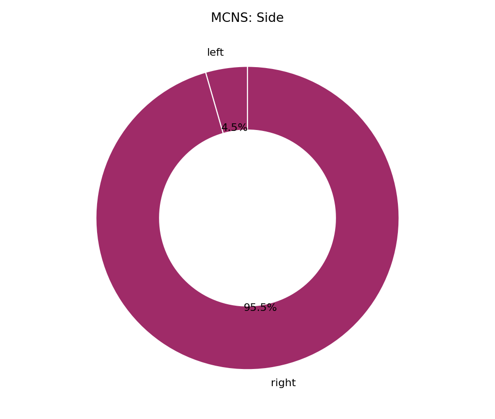

- `unspecified`: `Num Cells: 605`
  
  #### Super Class

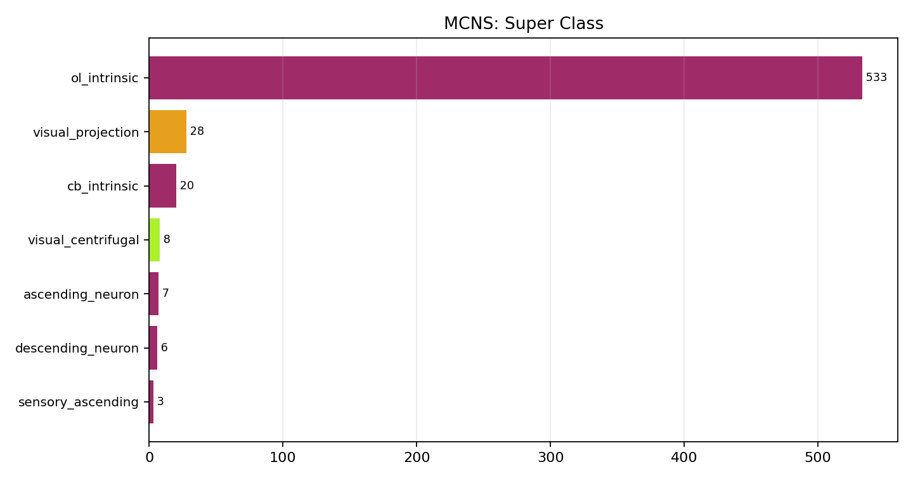

#### Class

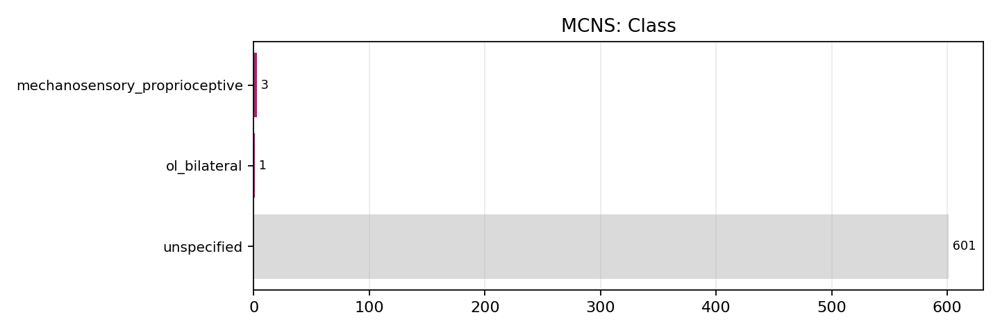

#### Sub Class

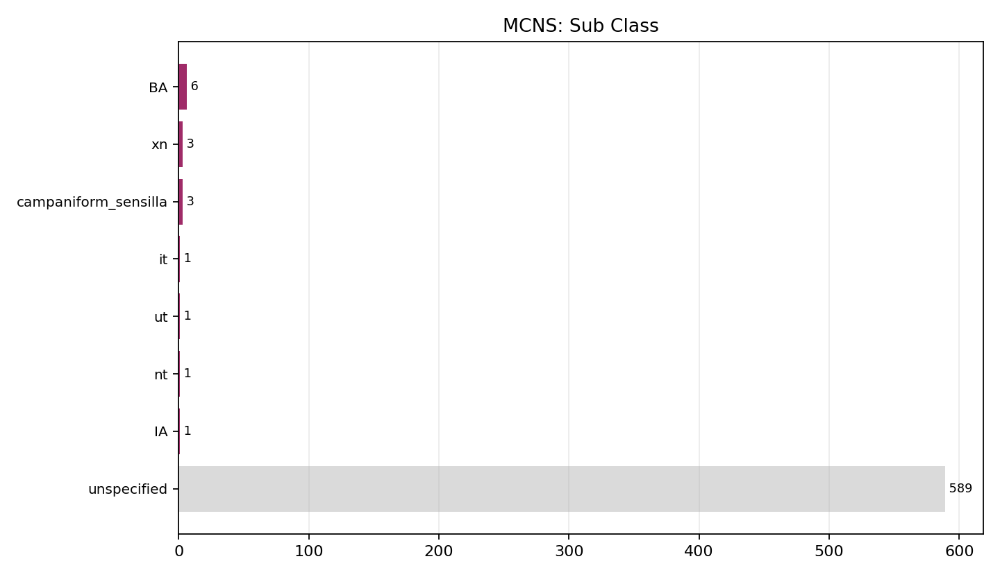

- `unspecified`: `Num Cells: 605`
- `unspecified`: `Num Cells: 605`